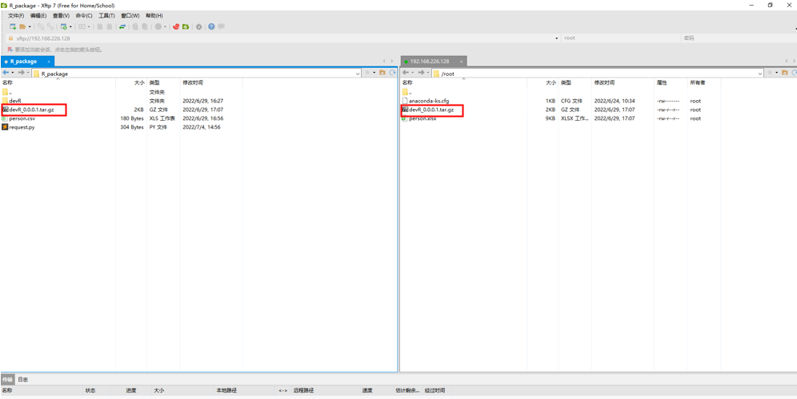

### Step 1: set up server

### Step 2: 制作docker镜像

可以理解为将需要的文件进行组合打包。主要利用dockerfile进行制作（安装opencpu, R package等）

### Step 3: 上传所需要的文件（如R包，数据 etc.)到容器内

将制作好的R包(制作R包可参考[这里](https://r-pkgs.org/whole-game.html))上传到服务器，并将其复制到对应的docker内部。可以利用FTP（File Transfer Protocol）工具来进行上传，上传完毕后安装R包。

### Step 4: 测试R包

提供接口 URL＋API参数，对 R function(R API) 进行测试,可以利用以下几种工具进行测试： - 利用接口测试工具（如 Postman） - 或者可以利用 Python 的 requests 进行 API 测试； - 或者利用curl命令进行测试

### Step 5: 提交R包(其他部门测试等)
